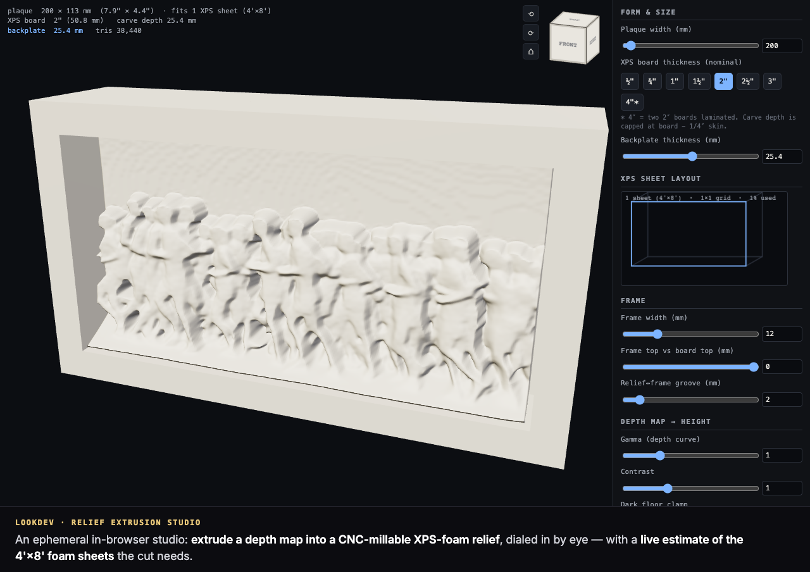
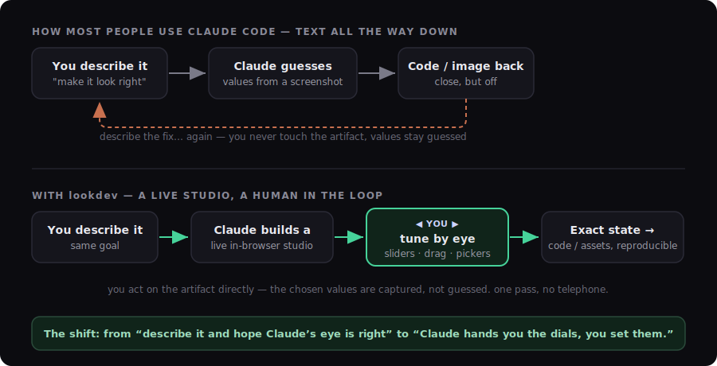

# lookdev

*lookdev is a Claude Code skill: a live human-in-the-loop web studio to tune AI-generated output by eye, then bake the chosen state into reproducible assets.*

   

**Stop guessing values from a screenshot. lookdev spins up a live, in-browser studio — sliders, color pickers, drag handles, inline markup — so you *dial in* AI-generated output by eye, then bakes the chosen state back into reproducible assets or code.**



*A real lookdev studio (the relief-extrusion example). Drag a control → it re-renders; you never type a number you guessed.*

## 🤔 Why

Claude Code is text-first. 📝 So when the work is *visual* — a blur radius, an easing curve, a crop, a color grade — it **guesses** the number off a screenshot and asks you to react in prose.

🐌 Slow. And lossy.

lookdev adds the missing mode: a **live studio you actually touch.** 👇 You drag → it re-renders → the exact value flows back to the agent.

> 🎯 Not a one-shot render. Not a Q&A where you dictate numbers. A studio you *manipulate* — **"show me, I'll pick"** beats **"ask me to specify."**

## 🔁 How it differs from how most people use Claude Code



The usual loop is text the whole way down:

> 📝 describe the look → 🤖 Claude guesses → 💻 code back → 👀 you squint → 📝 describe the fix → ⏳ wait → 🔁 repeat

Every lap is a **time-delayed round-trip** — minutes each.

lookdev collapses it to **seconds of real-time feedback.** ⚡ Claude builds the studio *once*; then **you** drag a slider and watch it update live — no regeneration to find out whether 12px or 16px was right.

The slow part of agent iteration was never the compute. 🧠 It's the **human round-trip** — translating a visual fix into words. Tuning by hand deletes that step, and the state you land on (exact, not guessed) *becomes* the code or asset.

> 🌱 **We didn't invent this.** It's a pattern already emerging in agent workflows — call it *ephemeral tooling*: the agent builds a disposable, single-use interface for one tuning session instead of iterating blind. lookdev just codifies it into a repeatable skill.

## ✨ What it does

Four things, really:

- 🎛️ **You tune, it updates live** — sliders, pickers, drag handles, scrubbers; every change re-renders instantly. No typing a number you guessed.
- 💾 **The result round-trips** — the state you dial in bakes back into reproducible JSON / settings / code (or STL metadata for 3D). *What you tuned is the deliverable* — not a screenshot to re-describe.
- 🎨 **Tune almost any visual axis** — image (dither · halftone · blur · grade), color (palettes · curves · tokens), type (size · weight · leading · measure), layout (drag · snap · crop), animation (easing · timing), component states, and full 3D material/lighting lookdev.
- 📝 **Or review prose & media** — inline edit, highlight-to-comment, anchored margin notes for posts, copy, and media sets.

## 🆚 vs. rolling your own studio

You don't *strictly* need a skill for this — you can just tell Claude *"build me a studio with sliders."* 🤷 So why lookdev?

Because from scratch, the agent re-invents the **groundwork UX** every time — and usually botches a piece of it:

- 🔌 the wiring that makes a control *actually* re-render the preview live
- 🧷 drag / resize handles, snap-to-grid, aspect-lock crop that feel right instead of janky
- 💾 a capture format that round-trips state back into real code/JSON — not a screenshot you have to re-explain
- 🌐 serving it on a free port and opening the tab for you
- 🗂️ the highlight + margin-comment layer for reviewing text and media
- 📱 a layout that's responsive and doesn't overflow the window on the first build

lookdev is that scaffolding, **codified once and reused.** 🧱 The agent starts from a known-good interaction model and spends its effort on *your* artifact, not on re-plumbing sliders. You get the **same capture contract every session** (reproducible, not bespoke) and studios that work on the *first* build — not the third.

> 💡 The difference between a one-off you *hope* renders and a **repeatable pattern** that does.

## 🧭 Two studio shapes

| | 🎚️ Visual-parameter lookdev | 📝 Text & media lookdev |
|---|---|---|
| The artifact | look set by numbers/choices (color, type, layout, image, 3D) | a document, post, copy, or media set |
| Controls | sliders · pickers · drag handles | inline edit · highlight · margin comments · media annotation |
| You're doing | tuning by feel | editing / curating / marking up |

## 📦 Install (Claude Code plugin)

```
/plugin marketplace add connerkward/ckw-skills
/plugin install lookdev@connerkward
```

Standalone (this repo only):

```
/plugin marketplace add connerkward/lookdev-studio-skill
/plugin install lookdev@lookdev
```

Or drop this repo's `SKILL.md` into your agent's skills directory.

## 🗂️ Part of [ckw-skills](https://github.com/connerkward/ckw-skills)

The human-in-the-loop sibling of [`lookdev-auto`](https://github.com/connerkward/lookdev-auto-skill) (a vision model is the eye) and [`deterministic-design`](https://github.com/connerkward/deterministic-design-skill) (measure the UI instead of trusting the eye).

## License

MIT © Conner K Ward

---

🧭 **[ckw-skills](https://github.com/connerkward/ckw-skills)** — part of Conner K. Ward's collection of Claude Code skills & MCP servers.
